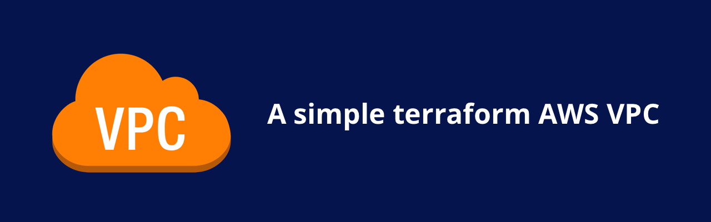

# AWS Terraform Simple VPC
A terraform module for implementing a very simple AWS VPC, with subnets, routes, and all the other bells and whistles.

## Why?
I'm doing a blogging series on some AWS services, and I need a base VPC to reference in my other blogs so the blog can focus on the fun part - this is that VPC.

## Getting Started
To run the example implementation, first make sure you have the AWS command line tool installed on your local machine, and you're able to run example commands.

You should be able to run the following command with no errors:
```bash
aws ec2 describe-vpc
```

You'll also need to make sure terraform is installed on your local machine.
```bash
terraform --version
```

Once you're ready, clone this repository, descend into the test directory, and run the init command:
```bash
cd aws_terraform_simple_vpc/test
terraform init
```

Once the init command is finished, you can run the apply command to deploy these changes live to the cloud.

**NOTE** This infrastructure will cost you money. Only keep it up as long as you need it. For me, it costs about $1 USD per day (the NAT gateway is expensive).

```bash
# Review the changes, and type 'yes' when ready
terraform apply
```

When you're ready to take it all down, run the following:
```bash
# Review the deletions, and type 'yes' when ready
terraform destroy
```

## Notes

### NAT Gateway
This VPC implementation uses a single NAT gateway for the private subnets. If you're not familiar with a NAT gateway, it's an AWS resource that lets machines running in your private subnets access the internet. Generally you'll need it, and it's best practice to have one for each subnet for high availability, but it costs about $30 USD / instance / month to run one. This module runs a single NAT gateway for all the subnets, and establishes routes to it.
